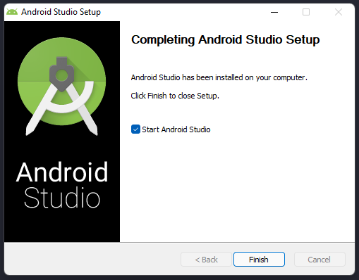

# Configurações no Windows

## **Node.js**

Para começarmos as configurações de ambiente, precisaremos instalar o **Node.js**.
Você pode baixa-lo [**aqui**](https://nodejs.org/en/download/) ou usar o **[NVM](https://github.com/nvm-sh/nvm) ( Node Version Manager)** para baixar qualquer versão do Node.js de forma mais simples.

## **JDK (Java Development Kit)**

O React Native também requer um **JDK (Java Development Kit)** que vocÇe pode baixá-lo [**aqui**](https://www.oracle.com/technetwork/java/javase/downloads/jdk8-downloads-2133151.html), selecionar a opção Windows e escolher a compatível com o seu sistema.

Ao executar o instalador, essa janela aparecerá e é só clicar em **Next**.

<h1 align="center">
  
</h1>

Você pode escolher o diretório onde o JDK será instalado. Mas não se preocupe, caso esqueça de mudá-lo agora, terá outra chance depois. Clique em **Next** para instalar o **JDK 8** .

<h1 align="center">
  
</h1>

Aparecerá essa tela para que possa alterar a pasta de instalação do JDK. Caso você não tenha um caminho de preferência, clique em **Próximo**.

<h1 align="center">
  
</h1>

Tudo ocorrendo bem, aparecerá a tela abaixo. Clique em **Close** para fechar e pronto, o JDK foi instalado!

<h1 align="center">
  
</h1>

## **Android Studio**

Agora que o **JDK** foi instalado, precisamos instalar o **[Android Studio](https://developer.android.com/studio)**. Ele é o responsavel por criar um **AVD (Android Virtual Device)** para seus projetos. Mais pra frente vamos ver como rodar um projeto no seu celular.

Clique em **Download Android Studio** para começarmos a instalação.

<h1 align="center">
  
</h1>

Aceite os termos de licença e clique em **Download**.

<h1 align="center">
  
</h1>

Será baixado um executável. Aguarde até o download terminar e abra o arquivo. Será aberto o instalador do **Android Studio**. Clique em **Next**.

<h1 align="center">
  
</h1>

Tenha certeza de que os componentes de instalação estão marcados e clique em **Next**.

>*Nota: Verifique se você tem o espaço de armazenamento requerido, no meu caso são 2.5GB*

<h1 align="center">
  
</h1>

Escolha o diretório onde o **Android Studio** será instalado e clique em **Next**.

<h1 align="center">
  
</h1>

Clique em **Install**.

<h1 align="center">
  
</h1>

O download do **Android Studio** será iniciado. Aguarde uns instantes porque o processo pode demorar um pouco. Ao finalizar, clique em **Next**.

<h1 align="center">
  
</h1>

Clique em **Finish** e o **Android Studio** será iniciado.

<h1 align="center">
  
</h1>

Ao iniciar o **Android Studio**, você pode importar configurações ja existentes, no meu caso, não importarei nenhuma. Clique em **OK** para continuar.

<h1 align="center">
  
</h1>

Agora que o **Android Studio** foi instalado, vamos fazer as devidas configurações. Clique em **Next**.

<h1 align="center">
  
</h1>

Selecione a opção **Custom** e clique em **Next**.

<h1 align="center">
  
</h1>

Agora, você terá que colocar o caminho do **JDK** que você instalou.  Clique em **Next**.

>*No meu caso, o caminho é: C:\Program Files (x86)\Java\jdk1.8.0_311*

<h1 align="center">
  
</h1>

Verifique se todos esses componentes estão marcados e clique em **Next**. Você tem a opção de alterar o caminho do **SDK**, mas não precisa.

<h1 align="center">
  
</h1>

Configure o quanto de memoria RAM você deseja dedicar ao **Android Studio**. Minha sujestão é entre 8GB e 12GB. Clique em **Next**.

<h1 align="center">
  
</h1>

Revise as configurações caso necessário e clique em **Finish**. Aguarde alguns instantes e pronto, o **Android Studio** está instalado e pronto para ser usado.

<h1 align="center">
  
</h1>

Ao finalizar a instalação, você será direcionado para a tela abaixo, onde criaremos um **AVD (Android Virtual Device)**. Clique em **More Actions** e **AVD Manager**.

<h1 align="center">
  
</h1>

Clique em **Create a virtual device**.

<h1 align="center">
  
</h1>

Escolha o modelo de celular que você deseja criar e clique em **Next**.
>*Nota: Escolha um modelo com o simbolo da play store, eu escolhi o Pixel 3a*

<h1 align="center">
  
</h1>

Escolha qual **API Level** você deseja para o seu AVD. Clique no download da API que desejar.
>*Nota: A partir do dia 01/11/2021 a play store parou de aceitar aplicativos com a API Level 29 ou inferior*

<h1 align="center">
  
</h1>

Aceite os termos de uso e clique em **Next**. Aguarde alguns instantes e clique em **Finish**. 

<h1 align="center">
  
</h1>

Com a **API Level** instalada e selecionada, você pode criar um novo AVD. Clique **Next**

<h1 align="center">
  
</h1>

Clique em **Finish** e o AVD será criado.

<h1 align="center">
  
</h1>

## **Configuração da variavel de ambiente**

Aperte a tecla **Windows** e digite **variaveis** e aperte **Enter**. Aparecerá uma tela das propriedades do sistema. Clime no úmtimo votão **Variáveis de Ambiente**.

<h1 align="center">
  
</h1>

Para adicionar uma nova variável de ambiente do usuário atual, clique em **Novo...** referente ao box **Variáveis de usuário para {nome do usuário}**.
<h1 align="center">
  
</h1>

Coloque em **Nome da variável** o nome ANDROID_HOME e em **Valor** o caminho de instalação do seu **SDK**.

Após isso, clique em **Ok** em todas as janelas abertas e pronto, sua variável de ambiente foi adicionada.

Para verificar se a variável foi realmente adicionada, abra o powershell e digite **Get-ChildItem -Path Env:** e procure por **ANDROID_HOME**.

>*Nota: O caminho do SDK default é: %LOCALAPPDATA%\Android\Sdk*

<h1 align="center">
  
</h1>

Se você ja tem o **JDK** instalado, tenha certeza que você tem o **JDK 8** instalado.

Se você ja tem o **Node.js** instalado, tenha certeza que você tem o **Node.js 12** ou mais recente instalado.

---------------------
Ir para [Primeiro Projeto](../3-HelloWorld/PrimeiroProjeto.md)